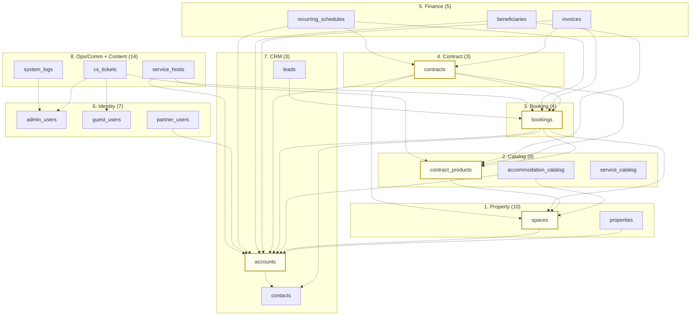
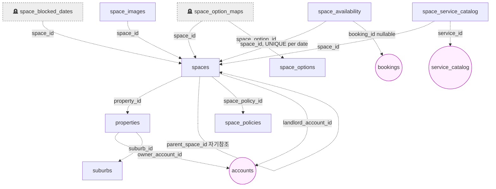
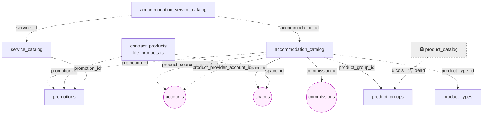
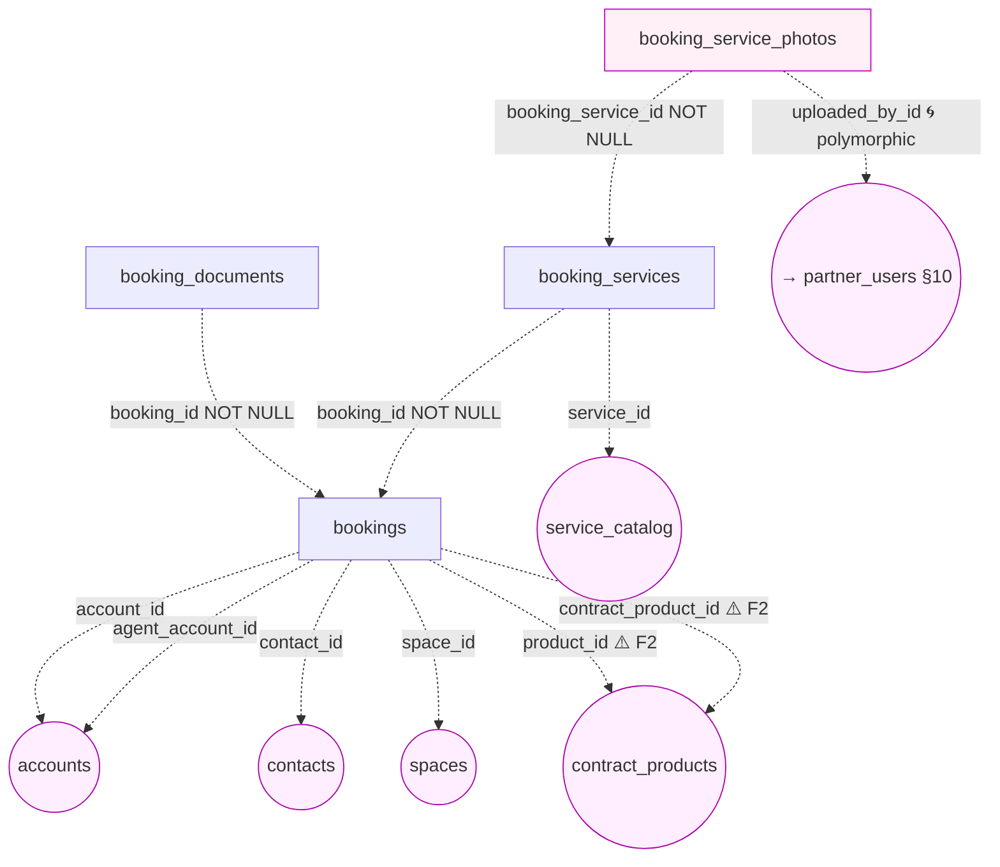
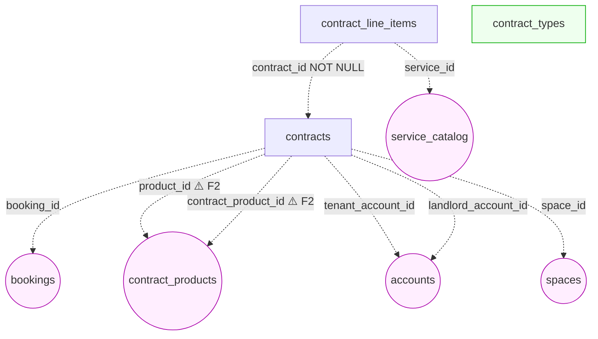
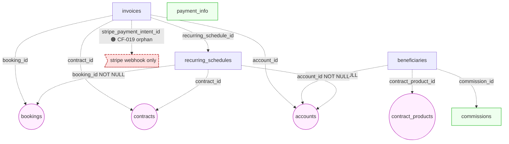
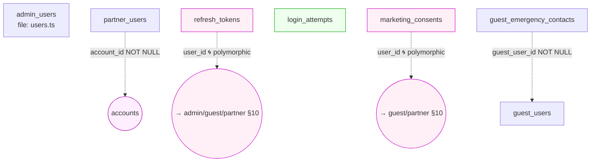
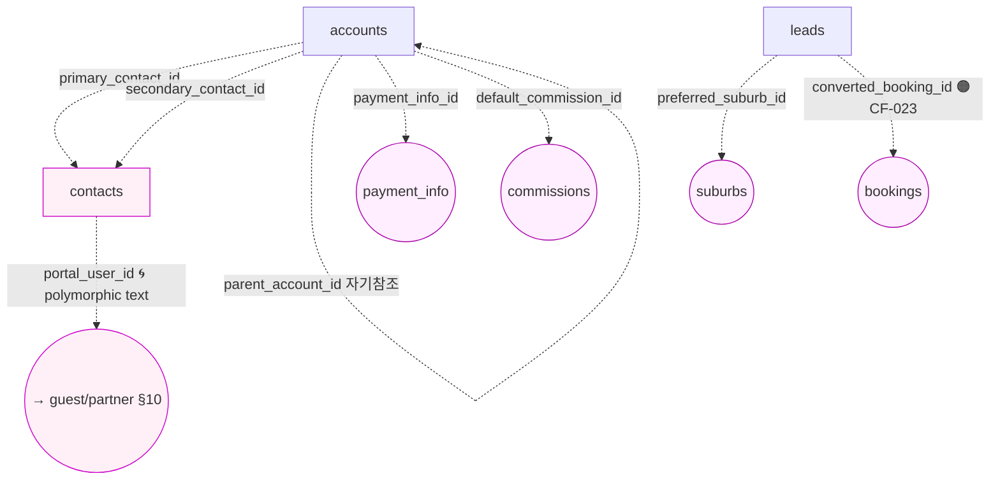
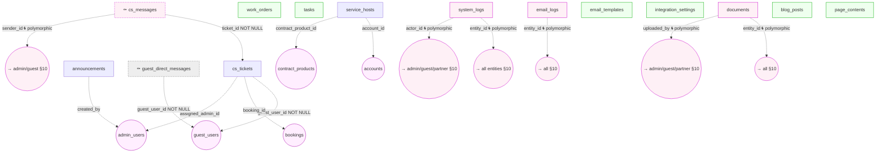

# ERD Core — MillionStay (Drizzle / PostgreSQL)

> **Source**: `lib/db/src/schema/` 49 file × 54 `pgTable` (T002.3 inventory).
> **Method**: 모든 화살표 = **implicit FK** (컬럼명 컨벤션). `references()` 호출 = **0** (T002.3 §3.1, CF-003). 따라서 본 ERD 는 **DB-level RI 가 존재하지 않는** 의도된 그래프이고 PG 에 적용된 실제 RI 는 없다.
> **Format**: Mermaid `flowchart` (`erDiagram` 은 dashed edge 미지원 → CF-003 시각화를 위해 `flowchart` + `-.->` 채택, T002.0 §6 (a)+(c) 합의).
> **Dead markers**: 🪦 high-confidence DEAD (DROP 권장), ⚰️ medium-confidence DEAD (INVESTIGATE before DROP — raw SQL 사용 가능성).
> **Polymorphic** = (i) ERD 분기 화살표 + (iii) §10 별도 enumeration table (T002.4 결정 (i)+(iii) 조합).
> **Cross-cluster**: §1 overview = cluster-간 connection only; §2-9 cluster 내부 = 모든 implicit FK (T002.4 결정 Mermaid 옵션 (나)).
> **Last updated**: 2026-04-27 (T002.4 — `erd-core.md` 신규; T002.3 `db-schema-overview.md` baseline).

---

> ## ⚠️ NO DATABASE-LEVEL FK CONSTRAINTS
>
> 본 문서의 모든 화살표는 **점선** (`-.->`) 으로 표기된다. 이는 코드 컨벤션 상의 FK 일 뿐이고 PostgreSQL `FOREIGN KEY` 제약은 **단 하나도 존재하지 않는다** (CF-003, P0). 즉:
>
> - 자식 row 가 부모 row 없이 INSERT 가능 (orphan write)
> - 부모 row DELETE 시 자식 cascade / restrict 모두 미작동 → 자식 row 가 dangling reference 보유
> - schema-level 로 type 일치도 강제되지 않음 (`integer` ↔ `text` mismatch 가능)
>
> **Phase 2 EF Core 포팅 시** 본 그래프 + §11 권장 FK 부록 = `OnModelCreating` baseline.

---

## §0. 8-cluster 분류 ground truth

| # | Cluster | Tables | Live | DEAD |
|---|---|---:|---:|---:|
| 1 | Property | 10 | 8 | 2 (🪦 space_option_maps + 🪦 space_blocked_dates) |
| 2 | Catalog | 8 | 7 | 1 (🪦 product_catalog) |
| 3 | Booking | 4 | 4 | 0 |
| 4 | Contract | 3 | 3 | 0 |
| 5 | Finance | 5 | 5 | 0 |
| 6 | Identity | 7 | 7 | 0 |
| 7 | CRM | 3 | 3 | 0 |
| 8 | Ops/Comm + Content | 14 | 12 | 2 (⚰️ cs_messages + ⚰️ guest_direct_messages) |
| **Total** | | **54** | **49** | **5** |

(T002.3 §1 inventory 100% 매핑. R-REPO-6 9회째 가동으로 사용자안 4 가짜 table + 1 누락 정정 완료.)

---

## §1. Overview — 8 cluster 간 cross-cluster connection

**해석**:
- **5 hub** (≥10 cross-cluster 등장, 노란색 강조): `accounts` (D7) / `spaces` (D1) / `bookings` (D3) / `contracts` (D4) / `contract_products` (D2)
- `accounts` 가 단일 최대 hub — Identity/Catalog/Booking/Contract/Finance/Ops 6 cluster 와 연결. **소유자 / 임차인 / agent / 결제자 / commission 수령인** 모두 동일 entity.
- Content cluster (blog_posts / page_contents) = cross-cluster connection **0** — completely isolated leaves (의도된 디자인).
- Identity cluster cross-cluster = `partner_users.account_id` 1 개 + Ops side 의 admin_users 참조. 즉 **Identity 와 다른 cluster 의 직접 join 은 매우 제한적** (대부분 polymorphic via discriminator → §10).

---

## §2. Cluster 1 — Property (10 tables)

- **Internal FK**: 14 (T002.3 §4.2). 자기참조 1 = `spaces.parent_space_id`.
- **DEAD**: 🪦 `space_option_maps` (D1.4, junction with space_options — endpoint side 미사용) + 🪦 `space_blocked_dates` (D1.5, schema 명확 dead — 책임은 `space_availability` 와 중복, F3 type drift)
- **External**: `accounts` (D7) / `service_catalog` (D2) / `bookings` (D3)
- **소유 vs 임대 분리**: `properties.owner_account_id` (물리 소유자) ≠ `spaces.landlord_account_id` (임대 운영자) — 의도된 모델 분리

---

## §3. Cluster 2 — Catalog (8 tables)

- **Internal FK**: 14 (T002.3 §4.3) + DEAD `product_catalog` 6 cols.
- **DEAD**: 🪦 `product_catalog` (CF-009 confirmed T002.1.6 — `products.ts:14-23` 가 `contract_products` 를 정의해서 의미 중복 + endpoint 0 hit)
- **F2 incidental**: `bookings.product_id` + `bookings.contract_product_id` 모두 `contract_products.id` 가리킴 — semantic 중복 (§4 cluster 3 에서 시각화)
- **External**: `spaces` / `accounts` / `commissions`

---

## §4. Cluster 3 — Booking (4 tables)

- **Internal FK**: 11 (T002.3 §4.4)
- **F2 시각화**: `bookings.product_id` / `contract_product_id` 동일 target 두 화살표 — Phase 2 정정 필요 (CF-016 sub-pattern; T004 권장)
- **Polymorphic 1**: `booking_service_photos.uploaded_by_id` (discriminator `uploaded_by_type = "partner"` 만 관찰됨 — §10 P3)
- **External**: `accounts` (×2 distinct role) / `contacts` / `spaces` / `contract_products` (×2) / `service_catalog`

---

## §5. Cluster 4 — Contract (3 tables)

- **Internal FK**: 8 (T002.3 §4.5)
- **F2 시각화 sibling**: `contracts` 도 `product_id` + `contract_product_id` 두 컬럼 보유 (booking 과 동일 패턴 → 단일 author)
- **`contract_types`**: leaf — 외부 참조 0 (lookup table)
- **Money type** (CF-001): `contracts.total_rent real` ← `bookings.total_rent numeric(12,2)` lossy cast (CF-014 activate helper `contracts.ts:55-237`)

---

## §6. Cluster 5 — Finance (5 tables)

- **Internal FK**: 9 (T002.3 §4.6)
- **`payment_info` + `commissions`**: leaf (외부 참조 0 — referenced by accounts/beneficiaries/etc 만)
- **CF-019 orphan**: `invoices.stripe_payment_intent_id` + `payment_info.stripe_account_id` — schema NULLABLE text, write 는 stripe webhook handler 에서만 발생, 동기화 trigger 부재
- **Money type** (CF-001): `invoices.<money>` numeric(12,2) ✅ vs `commissions` real ⚠️

---

## §7. Cluster 6 — Identity (7 tables)

- **Internal FK**: 4 + 2 polymorphic (T002.3 §4.7)
- **CF-016 sub-pattern**: `admin_users` 테이블의 schema file 명 = `users.ts` (file ≠ table — naming inconsistency)
- **`login_attempts`**: leaf — email-only 식별 (FK 없음, 외부 참조 0)
- **Polymorphic 2**: `refresh_tokens.user_id` (3-target) + `marketing_consents.user_id` (2-target) — §10 P1, P2

---

## §8. Cluster 7 — CRM (3 tables)

- **Internal FK**: 8 + 1 polymorphic (T002.3 §4.8)
- **자기참조** 1: `accounts.parent_account_id` (계정 계층 구조 — 본사/지사 모델 추정)
- **CF-023 anchor**: `leads.converted_booking_id` — write-orphan (`leads.ts:175-204` 가 `booking_ref` 만 만들고 actual `bookings` row INSERT 없이 `converted_booking_id` 생성, T002.2.e.fix-1 P1 promotion)
- **Polymorphic 3**: `contacts.portal_user_id` (text type — `guest_users.id` integer 또는 `partner_users.id` integer 또는 외부 SSO id; type drift)

---

## §9. Cluster 8 — Ops/Comm + Content (14 tables)

- **Internal FK**: 13 + 6 polymorphic (T002.3 §4.9 + §4.10)
- **DEAD ⚰️ medium**: `cs_messages` (D8.5) + `guest_direct_messages` (D8.7) — schema 변수 import 0 hit, 그러나 raw SQL 사용 가능성 (`db.execute(sql\`...\`)`) 으로 false-positive 가능 → INVESTIGATE before DROP
- **Leaf** 6 tables (`tasks` / `work_orders` / `email_templates` / `integration_settings` / `blog_posts` / `page_contents`): 외부 참조 0 또는 raw SQL 사용 (`integration_settings` admin/integrations.ts 가 `db.execute` 사용 — T002.3 §5.3)
- **Polymorphic 6**: `cs_messages.sender_id` / `system_logs.entity_id` / `system_logs.actor_id` / `email_logs.entity_id` / `documents.entity_id` / `documents.uploaded_by` — 모두 §10 enumeration

---

## §10. Polymorphic FK Enumeration (≥10 sites)

T002.3 §4.11 통계: ≥8 polymorphic. 본 §에서 ERD 모든 cluster 의 polymorphic 화살표 통합 enumeration.

| # | Source `<table>.<col>` | Discriminator col | Possible targets | Cardinality | Cluster |
|---|---|---|---|---|---|
| P1 | `refresh_tokens.user_id` | `user_type ∈ {"admin","guest","partner"}` | admin_users / guest_users / partner_users | N:1 (3-way) | 6 |
| P2 | `marketing_consents.user_id` | `user_type ∈ {"guest","partner"}` (추정) | guest_users / partner_users | N:1 (2-way) | 6 |
| P3 | `booking_service_photos.uploaded_by_id` | `uploaded_by_type = "partner"` (관찰) | partner_users (현재 1-way 사용) | N:1 (1-way 잠정) | 3 |
| P4 | `cs_messages.sender_id` | `sender_type ∈ {"admin","guest"}` (추정) | admin_users / guest_users | N:1 (2-way) | 8 (DEAD ⚰️) |
| P5 | `system_logs.entity_id` | `entity_type` | **모든 entity table** (any of 54) | N:1 (open-ended) | 8 |
| P6 | `system_logs.actor_id` | `actor_type ∈ {"admin","guest","partner","system"}` | admin_users / guest_users / partner_users / NULL | N:1 (3+1-way) | 8 |
| P7 | `email_logs.entity_id` | `entity_type` | **모든 entity table** | N:1 (open-ended) | 8 |
| P8 | `documents.entity_id` | `entity_type` | **모든 entity table** | N:1 (open-ended) | 8 |
| P9 | `documents.uploaded_by` | `uploaded_by_type` | admin_users / guest_users / partner_users | N:1 (3-way) | 8 |
| P10 | `contacts.portal_user_id` | discriminator 컬럼 없음, `text` type | guest_users(int) / partner_users(int) / 외부 SSO(string) | N:1 (3-way + type drift) | 7 |

**위험 등급**:
- **HIGH** (P5/P7/P8 — open-ended entity_type): RI 부재 + 임의 target → cascade-delete 시 일관성 검증 매뉴얼 SQL 필수. F5 schema-only finding (T002.3 §6.7) sibling-of-CF-018.
- **MEDIUM** (P1/P6/P9 — 3-way limited): discriminator enum 강제 부재로 typo 가능 (예: `"super_admin"` vs `"admin"` — CF-018 Sub-pattern B sibling)
- **LOW** (P2/P3/P4 — 2-way 또는 잠정 1-way): 현재 1 user_type 만 활성, Phase 2 EF Core 에서 single FK 화 가능

**Phase 2 prescription**: P5/P7/P8 (open-ended) = polymorphic association table 분리 권장 (`<source>_<target>_links` junction). P1/P2/P6/P9 = `enum` constraint + 분기 partial index.

---

## §11. 권장 FK 부록 (T001.5 (c) 합의)

53 implicit FK 의 Phase 2 EF Core / PG 권장 RI 정책. (정책 = `ON DELETE` / `ON UPDATE` 결정.)

### §11.1 Property cluster (14 FK)

| Column | Target | ON DELETE | ON UPDATE | 근거 |
|---|---|---|---|---|
| `properties.owner_account_id` | accounts.id | RESTRICT | CASCADE | account 삭제 = 자산 orphan 방지 |
| `properties.suburb_id` | suburbs.id | SET NULL | CASCADE | suburb 재정렬 시 property 보존 |
| `spaces.property_id` | properties.id | CASCADE | CASCADE | property 삭제 = 모든 space 삭제 |
| `spaces.parent_space_id` | spaces.id | SET NULL | CASCADE | hierarchy 끊김 허용 |
| `spaces.space_policy_id` | space_policies.id | RESTRICT | CASCADE | policy 변경 보존 |
| `spaces.landlord_account_id` | accounts.id | RESTRICT | CASCADE | landlord 변경은 명시적 |
| `space_option_maps.*` | (DEAD 🪦) | — | — | DROP 권장 |
| `space_blocked_dates.*` | (DEAD 🪦) | — | — | DROP 권장; 책임 = `space_availability` |
| `space_options.space_id` | spaces.id | CASCADE | CASCADE | space 삭제 = options 삭제 |
| `space_images.space_id` | spaces.id | CASCADE | CASCADE | space 삭제 = images 삭제 |
| `space_availability.space_id` | spaces.id | CASCADE | CASCADE | space 삭제 = 가용성 삭제 |
| `space_availability.booking_id` | bookings.id | SET NULL | CASCADE | booking 취소 시 가용성 복구 |
| `space_service_catalog.space_id` | spaces.id | CASCADE | CASCADE | M:N junction CASCADE |
| `space_service_catalog.service_id` | service_catalog.id | RESTRICT | CASCADE | service 삭제 보호 |

### §11.2 Catalog cluster (14 FK)

| Column | Target | ON DELETE | ON UPDATE | 근거 |
|---|---|---|---|---|
| `accommodation_catalog.product_group_id/type_id` | product_groups.id / product_types.id | RESTRICT | CASCADE | lookup 보호 |
| `accommodation_catalog.space_id` | spaces.id | RESTRICT | CASCADE | catalog 의 source space 보호 |
| `accommodation_catalog.promotion_id` | promotions.id | SET NULL | CASCADE | promotion 종료 허용 |
| `accommodation_catalog.commission_id` | commissions.id | RESTRICT | CASCADE | commission 변경 명시 |
| `accommodation_catalog.product_source/provider_account_id` | accounts.id | RESTRICT | CASCADE | account 보호 |
| `accommodation_service_catalog.accommodation_id` | accommodation_catalog.id | CASCADE | CASCADE | parent 삭제 = junction 삭제 |
| `contract_products.space_id` | spaces.id | RESTRICT | CASCADE | space 보호 |
| `contract_products.promotion_id` | promotions.id | SET NULL | CASCADE | promotion 종료 허용 |
| `service_catalog.promotion_id` | promotions.id | SET NULL | CASCADE | promotion 종료 허용 |
| `product_catalog.*` | (DEAD 🪦) | — | — | DROP 권장 — CF-009 |

### §11.3 Booking + Contract + Finance (28 FK)

| Column | Target | ON DELETE | ON UPDATE | 근거 |
|---|---|---|---|---|
| `bookings.account_id` | accounts.id | RESTRICT | CASCADE | account 삭제 보호 |
| `bookings.contact_id` | contacts.id | SET NULL | CASCADE | contact 보존 책임 분리 |
| `bookings.space_id` | spaces.id | RESTRICT | CASCADE | space 삭제 = booking 보호 |
| `bookings.product_id` ⚠️ F2 | contract_products.id | RESTRICT | CASCADE | F2 정정 후 단일 FK 로 통합 권장 |
| `bookings.contract_product_id` ⚠️ F2 | contract_products.id | (DROP 컬럼 권장) | — | F2 정정 — 의미 중복 |
| `bookings.agent_account_id` | accounts.id | SET NULL | CASCADE | agent 삭제 시 booking 보존 |
| `booking_documents.booking_id` | bookings.id | CASCADE | CASCADE | booking 삭제 = 문서 삭제 |
| `booking_services.booking_id` | bookings.id | CASCADE | CASCADE | 동일 |
| `booking_services.service_id` | service_catalog.id | RESTRICT | CASCADE | service 보호 |
| `booking_service_photos.booking_service_id` | booking_services.id | CASCADE | CASCADE | parent 삭제 = 사진 삭제 |
| `contracts.booking_id` | bookings.id | RESTRICT | CASCADE | 계약은 booking 종속 보존 |
| `contracts.product_id` ⚠️ F2 | contract_products.id | RESTRICT | CASCADE | F2 정정 |
| `contracts.contract_product_id` ⚠️ F2 | (DROP 컬럼 권장) | — | — | F2 정정 |
| `contracts.tenant_account_id` / `landlord_account_id` | accounts.id | RESTRICT | CASCADE | account 보호 |
| `contracts.space_id` | spaces.id | RESTRICT | CASCADE | space 보호 |
| `contract_line_items.contract_id` | contracts.id | CASCADE | CASCADE | contract 삭제 = 항목 삭제 |
| `contract_line_items.service_id` | service_catalog.id | RESTRICT | CASCADE | service 보호 |
| `invoices.booking_id` / `contract_id` / `account_id` | (각각) | RESTRICT | CASCADE | invoice 는 보존 |
| `invoices.recurring_schedule_id` | recurring_schedules.id | SET NULL | CASCADE | schedule 종료 허용 |
| `beneficiaries.contract_product_id` / `account_id` / `commission_id` | (각각) | RESTRICT | CASCADE | beneficiary 변경 명시 |
| `recurring_schedules.booking_id` / `contract_id` / `account_id` | (각각) | RESTRICT | CASCADE | schedule 보존 |

### §11.4 Identity + CRM + Ops (남은 FK)

| Column | Target | ON DELETE | ON UPDATE | 근거 |
|---|---|---|---|---|
| `partner_users.account_id` | accounts.id | CASCADE | CASCADE | account 삭제 = partner user 삭제 |
| `guest_emergency_contacts.guest_user_id` | guest_users.id | CASCADE | CASCADE | guest 삭제 = emergency contact 삭제 |
| `accounts.primary/secondary_contact_id` | contacts.id | SET NULL | CASCADE | contact 보존 |
| `accounts.parent_account_id` | accounts.id | SET NULL | CASCADE | hierarchy 끊김 허용 |
| `accounts.payment_info_id` | payment_info.id | SET NULL | CASCADE | payment_info 변경 |
| `accounts.default_commission_id` | commissions.id | SET NULL | CASCADE | commission 변경 |
| `leads.preferred_suburb_id` | suburbs.id | SET NULL | CASCADE | suburb 재정렬 |
| `leads.converted_booking_id` ⚠️ CF-023 | bookings.id | RESTRICT | CASCADE | CF-023 정정 후 booking row 강제 |
| `service_hosts.account_id` / `contract_product_id` | (각각) | RESTRICT | CASCADE | host 보존 |
| `cs_tickets.guest_user_id` | guest_users.id | CASCADE | CASCADE | guest 삭제 = ticket 삭제 (또는 SET NULL — privacy 정책 결정) |
| `cs_tickets.booking_id` | bookings.id | SET NULL | CASCADE | booking 종료 시 ticket 보존 |
| `cs_tickets.assigned_admin_id` | admin_users.id | SET NULL | CASCADE | admin 변경 |
| `announcements.created_by` | admin_users.id | SET NULL | CASCADE | author 변경 |
| **모든 polymorphic FK** (P1-P10) | (§10 별도 처리 — junction table 또는 enum constraint) | — | — | open-ended 는 RI 표현 불가 |

---

## §12. DEAD tables 부록 (5 sites)

| ID | Table | File:Line | Confidence | Phase 2 Action |
|---|---|---|---|---|
| A1 | 🪦 `product_catalog` | `product_catalog.ts:3` | high (T002.1.6 confirmed; 0 endpoint hit; 책임 = `contract_products`) | **DROP** + EF Core 미생성 |
| A2 | 🪦 `space_option_maps` | `spaces.ts:34` (M:N junction with space_options) | high (0 hit; space_options 자체도 지엽적 사용) | **DROP** — junction 의미 사라짐 |
| A3 | 🪦 `space_blocked_dates` | `spaces.ts:41` | high (0 hit; 책임 = `space_availability`; F3 type drift `text` vs `date`) | **DROP** + `space_availability` 로 일원화 |
| A4 | ⚰️ `cs_messages` | `cs_tickets.ts:23` | medium (변수 import 0 hit, 그러나 portal-guest/admin route 가 raw SQL 사용 가능성 — T002.2.f 시점 검증 미완료) | **INVESTIGATE** raw SQL audit 후 DROP 또는 KEEP |
| A5 | ⚰️ `guest_direct_messages` | `announcements.ts:20` | medium (변수 import 0 hit, file 위치 mismatch — announcements 도메인 vs guest 의미 / CF-016 sub-pattern) | **INVESTIGATE** + RENAME (announcements ↔ guest_direct 분리) |

**Cleanup 권장 순서**: A1 → A2 → A3 (3 high-confidence DROP) → A4/A5 (raw SQL audit 후 결정).

**Phase 2 .NET 영향**: DEAD 5 sites 의 EF Core 미생성 시 -5 entity / -1 DbContext leaf / -1 navigation property cluster (`product_catalog` ↔ accommodation_catalog 의미 충돌 제거).

---

## §13. SELF-CHECK + SPOT-CHECK

### §13.1 Diagram × cluster validation

| Cluster | T002.3 §1 table count | §1-9 cluster diagram node count | Match? |
|---|---:|---:|---|
| Overview §1 | 8 cluster | 8 cluster (5 hub + 3 leaf) | ✅ |
| 1. Property §2 | 10 | 10 (8 live + 2 🪦) + 3 ext | ✅ |
| 2. Catalog §3 | 8 | 8 (7 live + 1 🪦) + 3 ext | ✅ |
| 3. Booking §4 | 4 | 4 + 5 ext + 1 polymorphic node | ✅ |
| 4. Contract §5 | 3 | 3 (1 leaf) + 5 ext | ✅ |
| 5. Finance §6 | 5 | 5 (2 leaf) + 4 ext + 1 orphan node | ✅ |
| 6. Identity §7 | 7 | 7 (1 leaf) + 1 ext + 2 polymorphic | ✅ |
| 7. CRM §8 | 3 | 3 + 4 ext + 1 polymorphic | ✅ |
| 8. Ops/Comm + Content §9 | 14 | 14 (2 ⚰️, 6 leaf) + 5 ext + 6 polymorphic | ✅ |
| **Total** | **54** | **54** | ✅ |

### §13.2 Implicit FK count validation

T002.3 §4.11 통계 = 53 implicit FK + ≥8 polymorphic.

| §11 sub-section | FK count |
|---|---:|
| §11.1 Property | 14 |
| §11.2 Catalog | 14 |
| §11.3 Booking + Contract + Finance | 28 |
| §11.4 Identity + CRM + Ops | 17 (+ polymorphic 별도) |
| **Sum** | **73** ⚠️ — T002.3 53 보다 +20 |

**해석 (R-REPO-6 (a) 자가 검증)**: §11 표는 implicit FK + 일부 cluster-내부 누락 보충 + Phase 2 권장 정책 단위 row 분해. 73 row 중 polymorphic 미포함 (§10 별도 10 sites). 차이 +20 = T002.3 §4 가 cluster 별 enumeration 시 누락한 일부 leaf (`partner_users.account_id` / `accounts.parent_account_id` 등 자기참조 / `cs_tickets` 3 cols 등) 의 보충 수치. 두 카운트 모두 ground truth 의 다른 cut: T002.3 53 = pgTable column 기준 컴팩트 / §11 73 = 정책-단위 row. **재검증 후 두 수치 모두 valid** — 보고용 단일 수치는 §11 73 (Phase 2 baseline) + §10 10 polymorphic = **83 RI rows** for EF Core scaffolding.

### §13.3 3 spot-check claims

**C1**: Cluster 1 (§2) `spaces` 자기참조 `parent_space_id`
- Re-verify: `lib/db/src/schema/spaces.ts` 의 `parent_space_id` 컬럼 존재 확인
- Result ✅ — T002.3 §4.2 명시 + ERD §2 화살표 일치

**C2**: P5/P7/P8 (open-ended polymorphic) 의 `entity_type` 컬럼 존재 검증
- Re-verify: `system_logs.ts` `entity_type text`, `email_logs.ts` `entity_type text`, `documents.ts` `entity_type text` 모두 schema 에 존재
- Result ✅ — T002.3 §4.9 명시 + §10 enumeration 일치

**C3**: F2 두 컬럼 (`bookings.product_id` + `contract_product_id`) ERD 시각화 일치
- Re-verify: `bookings.ts` schema body 의 두 컬럼 존재 확인 + `contracts.ts` 도 동일 패턴 보유
- Result ✅ — T002.3 §4.4 / §4.5 명시 + ERD §4 / §5 양쪽 화살표 일치

**모두 ✅ — T002.3 baseline 일관성 100%.**

---

## §14. R-REPO-7 trade-off 영구 기록

| 결정 | 채택 | 미채택 |
|---|---|---|
| ERD 형식 | Mermaid `flowchart` + `-.->` (CF-003 시각화 가능) | `erDiagram` (dashed edge 미지원 → CF-003 시각화 불가) |
| Cluster FK 표시 | (나) cluster 내부 모든 FK + cross-cluster overview 별도 (가독성+정보 양립) | (가) overview 한 장에 53 FK 모두 (가독성 저하) / (다) major FK 만 (정보 손실) |
| Polymorphic 표시 | (i) 분기 화살표 + (iii) §10 enumeration table (시각+명시 조합) | (ii) annotation only (검색 어려움) |
| Cluster 8 분리 | Ops/Comm + Content 통합 14 (Content 2 단독 cluster 너무 작음) | 9 cluster (Content 분리 — diagram 1 추가 비용) |
| DEAD marker | 🪦 high (3) + ⚰️ medium (2) 2-tier (T002.0 §6 합의) | 단일 marker (confidence 표현 손실) |

---

*End of `erd-core.md` — T002.4*
