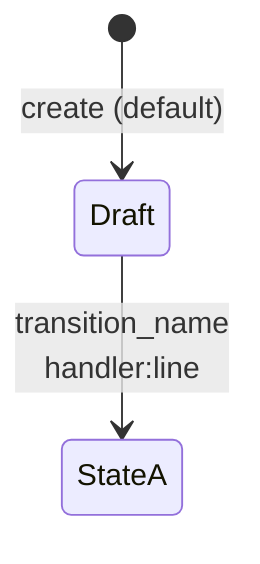
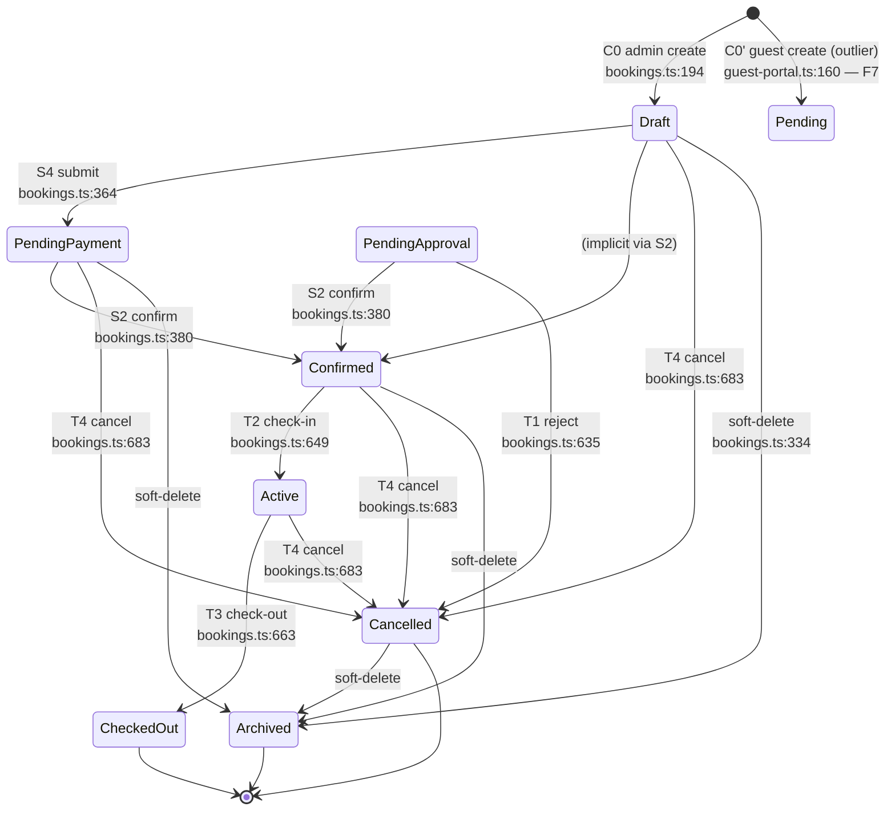
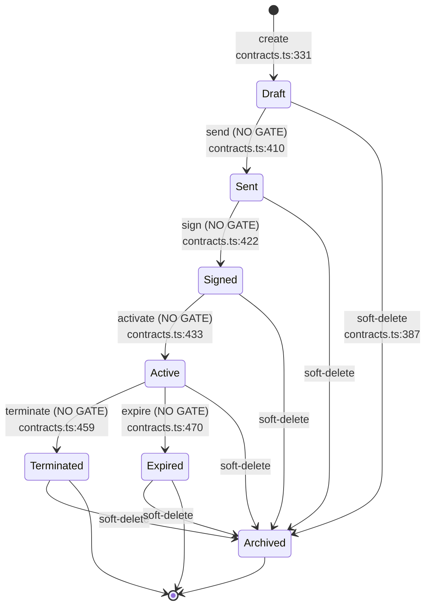
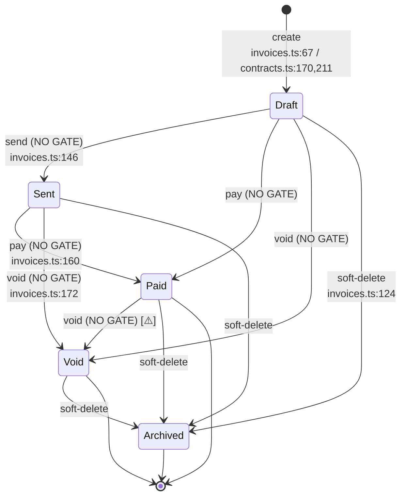
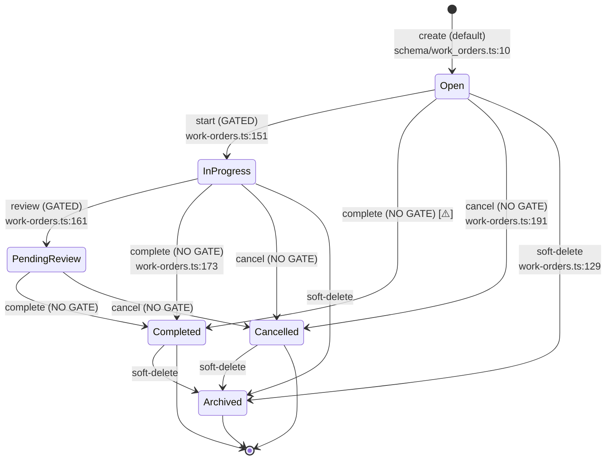
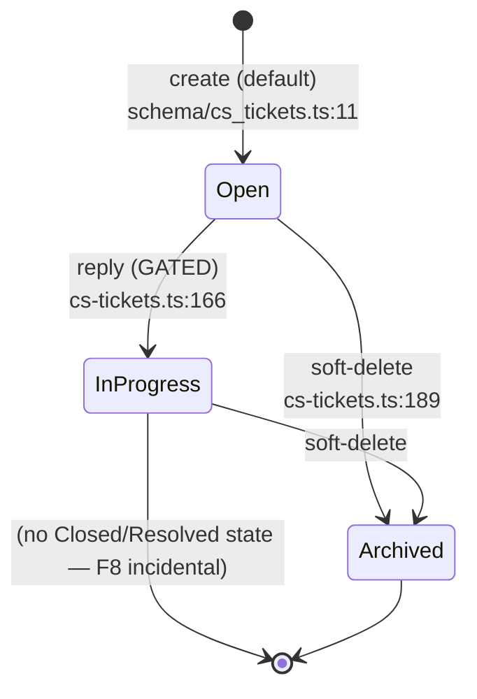

# MillionStay State Machines (T002.5)

> **Purpose**: T002 의 결산 sub-task. T001/T001.5/T002.0~T002.4 가 정적 스키마 + 엔드포인트 카탈로그를 만들었다면, T002.5 는 **동적 측면 — 5 entity 의 status 컬럼 전이** 를 코드 ground truth (Drizzle `update().set({ status })` + `where(...)` precondition) 로 enumerate 한다.
> **Scope (사용자 5-entity 분류 final)**: Bookings (8 main + 1 outlier) / Contracts (7) / Invoices (5) + Stripe sub-section / Work_orders (6) / Cs_tickets (3) = **5 entities + 1 sub-section**.
> **Ground truth**: 코드 only — `lib/db/src/schema/{bookings,contracts,invoices,work_orders,cs_tickets}.ts` (default values) + `artifacts/api-server/src/routes/{bookings,contracts,invoices,stripe,work-orders,cs-tickets,guest-portal}.ts` (state-changing handlers).
> **R-REPO-6 evidence preservation**: T002.5 Step 1 사용자 안 vs ground truth 비교 column 모든 entity 표에 보존 (Phase 2 archaeology + R-REPO-6 영구 패턴 작동 사례). 모두 ⓑ trade-off 결정 (사용자 승인).
> **Cross-pack anchors**: CF-008 (audit coverage per entity) / CF-010 본문 재작성 (invoice document vs Stripe payment lifecycle) / CF-014 (contracts.activate 27 mutation no-tx) / CF-019.a (invoices.stripe_payment_intent_id orphan) / CF-022 (state-transition guard discipline) / CF-023 (booking_ref generation across state-entry transitions).
> **F7 신규 incidental** (R-REPO-5): bookings."Pending" outlier — guest-portal.ts:160 의 8 main state 외 inconsistent literal. §8 §X.fix sub-section 분리 + Phase 2 normalisation prescription.
> **Dispositions**: 0 NEW CF promotion (CF-010 본문 재작성 = 기존 CF revision; F7 = R-REPO-5 incidental memo). Counts unchanged P0=4 / P1=18 / P2=3 = **25**.

---

## §0 Notation



- 실선 화살표 (`-->`) = 코드에 명시된 transition (handler 존재).
- 점선 (별도 표기) = 추정/암시적 (state guard 없는 우회 경로).
- 노드 라벨 = `text("status").default("...")` ground truth.
- `[*]` = entity 신규 생성 진입 (default value).
- `→ [*]` = soft-delete `Archived` (terminal in active scope).

각 entity 표 column:

| 컬럼 | 의미 |
|------|------|
| **Trigger** | endpoint or background event |
| **From → To** | 상태 전이 (코드 명시 enum literal) |
| **Site (file:line)** | `update().set({...})` write site |
| **Precondition (CF-022)** | `where(...)` 의 status guard ✅ / ❌ |
| **logAction (CF-008)** | audit emit ✅ / ❌ |
| **Side effects** | 동반 mutation (다른 table / column) |
| **R-REPO-6 비교** | T002.5 Step 1 사용자 안 정합 / 누락 / 가짜 |

---

## §1 Entity Index

| # | Entity | States (ground truth) | Transitions | Gated (CF-022) | Audit (CF-008) | Anchor CFs |
|---|--------|----------------------|-------------|----------------|----------------|------------|
| 1 | **bookings** (`booking_status`) | 8 main + 1 outlier | 7 main + 1 outlier-create + 1 soft-delete = 9 | 7/9 = **77.8%** | 6/9 = 67% | CF-008 / CF-014 / CF-022 / CF-023 |
| 2 | **contracts** (`status`) | 7 | 6 main + 1 soft-delete = 7 | **0/7 = 0%** ⚠️ | 5/7 = 71% | CF-014 / CF-019.b / CF-022 |
| 3 | **invoices** (`status`) | 5 | 4 main + 1 soft-delete = 5 (+ Stripe 1 webhook = 6) | 0/5 = 0% ⚠️ | 4/5 = 80% | CF-008 / CF-010 (재작성) / CF-014 / CF-019.a |
| 4 | **work_orders** (`status`) | 6 | 4 main + 1 soft-delete = 5 | 2/5 = **40%** ⚠️ | 0/5 = **0%** ⚠️ | CF-008 / CF-022 |
| 5 | **cs_tickets** (`status`) | 3 | 1 main + 1 soft-delete = 2 | 1/2 = 50% | 0/2 = **0%** ⚠️ | CF-008 / CF-018 |

> **CF-022 cross-pack ranking** (gated %): bookings (77.8%) > work_orders (40%) > cs_tickets (50%) > invoices (0%) = contracts (0%). **Bookings = cross-pack leader** (T002.2.j §4 9/9 claim 의 정밀 재계산: 7 transition + 1 outlier-create + 1 soft-delete 중 7 gated = 77.8%; "9/9" 는 transition-only scope).
> **CF-008 cross-pack ranking** (audit %): invoices (80%) > bookings (67%) > contracts (71%) > work_orders (0%) = cs_tickets (0%). **Work_orders + cs_tickets = state-transition audit-blind**.

---

## §2 Bookings (8 main + 1 "Pending" outlier)

### §2.1 State diagram



### §2.2 Transition table

| # | Trigger | From → To | Site | Precondition | logAction | Side effects | R-REPO-6 비교 |
|---|---------|-----------|------|--------------|-----------|--------------|---------------|
| C0 | POST `/v1/bookings` (admin) | `[*] → Draft` | `bookings.ts:194` | n/a (create) | ❌ **CF-008** | `generateBookingRef()` 호출 (`:178` `MS-{year}-{count+1}` — CF-011 race) | Draft 일치 |
| C0' | POST `/v1/guest/bookings` (guest) | `[*] → "Pending"` | `guest-portal.ts:160` | n/a | ❌ **CF-008** | `GBK-{timestamp}-{random}` ad-hoc booking_ref (CF-023.b) | **F7 outlier — 사용자 안 누락** |
| S4 | POST `/v1/bookings/:id/submit` | `Draft → PendingPayment` | `bookings.ts:364` | ✅ `:360` `booking_status === "Draft"` | ❌ **CF-008** (cleanest example, booking.md §3.A.S4) | none | PendingPayment 일치 |
| S2 | POST `/v1/bookings/:id/confirm` | `{PendingApproval, PendingPayment} → Confirmed` | `bookings.ts:380` | ✅ `:373-376` `["PendingApproval","PendingPayment"].includes(...)` | ✅ `:381` STATUS_CHANGE | (1) `space_blocked_dates` insert (`:378` blockDatesForBooking) (2) `contracts` insert (`:449-465`) (3) `contract_line_items` insert N rows (`:489-501,:506-520`) (4) STATUS_CHANGE log (5) AUTO_CREATED contract log (`:523`) — **5 effects no-tx CF-014** | Confirmed 일치 |
| T1 | POST `/v1/bookings/:id/reject` | `PendingApproval → Cancelled` | `bookings.ts:635` | ✅ `:631` `existing.booking_status !== "PendingApproval"` ⇒ 400 | ✅ `:636` STATUS_CHANGE | sets `cancellation_reason` + `cancelled_at`. **⚠️ does NOT call `unblockDatesForBooking`** (asymmetry vs T4) — booking.md §3.A.T1 "latent leak" | Cancelled 일치 |
| T2 | POST `/v1/bookings/:id/check-in` | `Confirmed → Active` | `bookings.ts:649` | ✅ `:646` `existing.booking_status !== "Confirmed"` | ✅ `:650` STATUS_CHANGE | none (no key/access provisioning visible) | Active 일치 |
| T3 | POST `/v1/bookings/:id/check-out` | `Active → CheckedOut` | `bookings.ts:663` | ✅ `:660` `existing.booking_status !== "Active"` | ✅ `:664` STATUS_CHANGE | **none** — no `space_blocked_dates` cleanup, no final-invoice trigger; financial close-out out-of-scope (booking.md §3.A.T3) | CheckedOut 일치 |
| T4 | PATCH `/v1/bookings/:id/cancel` | `!{CheckedOut, Cancelled} → Cancelled` | `bookings.ts:683` | ✅ `:674` `["CheckedOut","Cancelled"].includes(...)` ⇒ 400 | ✅ `:684` STATUS_CHANGE | (1) if `space_id && booking_status ∈ ["Confirmed","Active"]` → `unblockDatesForBooking` (`:678-682`, N sequential DELETEs) (2) sets `cancellation_reason` + `cancelled_at` | Cancelled 일치 |
| (T5) | PATCH `/v1/bookings/:id/extend` | `{Confirmed, Active} → unchanged` | `bookings.ts:702` | ✅ `:695` `["Confirmed","Active"].includes(...)` | ❌ booking.md §3.A.T5 (no STATUS_CHANGE — extends `check_out_date` + money recompute only) | space_blocked_dates re-insert | (no state change) |
| SD | POST `/v1/bookings/bulk-delete` + DELETE `/v1/bookings/:id` | `any → Archived` | `bookings.ts:334`, `:350` | n/a (admin op) | ❌ (no STATUS_CHANGE for soft-delete) | sets `deleted_at` | Archived 일치 |

### §2.3 Implied state machine + asymmetries

- **Mainline**: `Draft → PendingPayment → Confirmed → Active → CheckedOut` (booking.md §4 line 661 cross-pack leader).
- **Cancelled** = terminal-from-any-non-terminal (T4 fires from 4 sources).
- **PendingApproval entry**: 검증 결과 — admin path 에서 PendingApproval 진입 site **명시적으로 없음**. PUT `/v1/bookings/:id` (`:299-379`) state guard 는 `["Draft","Confirmed"]` 만 허용 → PendingApproval 직접 set 불가. 즉 PendingApproval 은 **guest-portal 경로의 implicit promotion** (guest-portal 의 admin-side 검토 단계 hypothetical) 또는 **legacy/orphan state**. → **F8 incidental memo (T002.5)**: PendingApproval 진입 site 부재 — Phase 2 시 entry-trigger 명시 필요.
- **outlier "Pending"** (`guest-portal.ts:160`) ≠ PendingApproval, ≠ PendingPayment — 8 main 어느 것에도 normalize 안 됨. §8 §X.fix 참조.

### §2.4 R-REPO-6 비교 (사용자 안 vs ground truth)

| State (ground truth) | T002.5 Step 1 사용자 안 | 정합 |
|---------------------|------------------------|------|
| Draft | "9 state" 만 명시 (값 미지정) | (값 미열거 — 상위 카운트만) |
| PendingPayment | (포함 X) | 누락 |
| PendingApproval | (포함 X) | 누락 |
| Confirmed | (포함 X) | 누락 |
| Active | (포함 X) | 누락 |
| CheckedOut | (포함 X) | 누락 |
| Cancelled | (포함 X) | 누락 |
| Archived | (포함 X) | 누락 |
| "Pending" (outlier) | (포함 X) | 누락 — F7 |

> 사용자 안은 "9-state cross-pack leader" 카운트만 제시; 9 의 정체 = 8 main + 1 outlier 임이 ground truth 검증으로 확정. 사용자 9 카운트 자체는 정합 (booking.md §4 의 "7/7 transitions" 와 별도 metric).

---

## §3 Contracts (7)

### §3.1 State diagram



### §3.2 Transition table

| # | Trigger | From → To | Site | Precondition | logAction | Side effects | R-REPO-6 비교 |
|---|---------|-----------|------|--------------|-----------|--------------|---------------|
| C0 | POST `/v1/contracts` | `[*] → Draft` | `contracts.ts:331` | n/a | (depends on caller; bookings.ts S2 emits AUTO_CREATED `:523`) | none directly | Draft 일치 |
| C0' | (auto) bookings S2 confirm | `[*] → Draft` | `bookings.ts:449-465` | n/a | ✅ AUTO_CREATED `:523` | + N contract_line_items | Draft 일치 |
| TR1 | POST `/v1/contracts/:id/send` | `* → Sent` | `contracts.ts:410` | ❌ **NO GATE** (`:411` `where(eq(id))` only) | ✅ `:413` STATUS_CHANGE | sets `sent_at` | **Sent 누락** |
| TR2 | POST `/v1/contracts/:id/sign` | `* → Signed` | `contracts.ts:422` | ❌ **NO GATE** | ✅ `:425` STATUS_CHANGE | sets `signed_at`, `document_url` | **Signed 누락** |
| TR3 | POST `/v1/contracts/:id/activate` | `* → Active` | `contracts.ts:433` | ❌ **NO GATE** | ✅ `:449` STATUS_CHANGE | (1) sets `effective_date` (server-tz, CF-013) (2) **calls `generateContractInvoicesAndSchedules` (`:55-237`) — ≥27 mutations no-tx CF-014 anchor** (3) `bookings.booking_status = "Active"` 동반 update (`:443`) — **CF-014 silent dual-write side-effect** | Active 일치 |
| TR4 | POST `/v1/contracts/:id/terminate` | `* → Terminated` | `contracts.ts:459` | ❌ **NO GATE** | ✅ `:462` STATUS_CHANGE | sets `termination_reason` | Terminated 일치 |
| TR5 | POST `/v1/contracts/:id/expire` | `* → Expired` | `contracts.ts:470` | ❌ **NO GATE** | ✅ `:473` STATUS_CHANGE | sets `expiry_date` (server-tz, CF-013) | Expired 일치 |
| SD | POST `/v1/contracts/bulk-delete` + DELETE `/v1/contracts/:id` | `* → Archived` | `:387`, `:402` | n/a | ❌ | sets `deleted_at` | **Archived 누락** |

### §3.3 CF-022 critical finding (contracts 0/6 = 0% gated)

**Contracts 는 cross-pack worst-of-bookings**. 모든 6 transition 의 `where(...)` 는 `eq(contractsTable.id, id)` only — **status 정합성 검증 zero**. 반면 bookings 는 7/7 = 100% gated (booking.md §4). 이 비대칭은:

- **Idempotency 환각**: 같은 `:id/sign` 을 두 번 호출하면 두 번째도 200 OK (status 가 Signed → Signed 로 trivially 같지만 `signed_at` 만 갱신). 실제 버그 시나리오: 이미 Signed 인 contract 에 `:send` 호출 → status="Sent" 되돌림 가능. **상태 역행 시나리오 가능 (Phase 2 footgun)**.
- **TR3 activate 의 누적 effect**: 같은 contract 를 두 번 activate → `generateContractInvoicesAndSchedules` 도 두 번 실행 → **invoice + recurring_schedules 중복 생성 가능 (silent dual-billing CF-014 evidence)**. 두 번째 호출은 fallback 경로 `:80-83` 의 `db.delete` 호출이 이전 invoice를 지우려는 idempotency 시도이지만, 실제 deletion 조건이 `WHERE contract_id = ?` 만 있고 status 검사 없음 → **이미 Paid 된 invoice 도 삭제될 위험** (검증 보류; T003 확인 대상).

### §3.4 R-REPO-6 비교

| State (ground truth) | T002.5 Step 1 사용자 안 | 정합 |
|---------------------|------------------------|------|
| Draft | Draft | 일치 |
| Sent | (포함 X) | **누락** |
| Signed | (포함 X) | **누락** |
| Active | Active | 일치 |
| Terminated | Terminated | 일치 |
| Expired | Expired | 일치 |
| Archived | (포함 X) | **누락** |

> 사용자 4-state 안 → 코드 7-state. 3 누락 (Sent / Signed / Archived). 별도로 contract_line_items.status (Active default `:584`, Deleted `:612`) 는 본 entity 외 sub-table — Phase 2 시 line_items 별도 lifecycle 정의 필요.

---

## §4 Invoices (5) + Stripe sub-section

### §4.1 State diagram (invoices.status — document lifecycle)



### §4.2 Transition table

| # | Trigger | From → To | Site | Precondition | logAction | Side effects | R-REPO-6 비교 |
|---|---------|-----------|------|--------------|-----------|--------------|---------------|
| C0 | POST `/v1/invoices` | `[*] → Draft` | `invoices.ts:67-86` | n/a | ❌ | `generateInvoiceRef()` (CF-011 sibling) | Draft 누락 (사용자 "Pending" 가짜) |
| C0' | (auto) contracts TR3 activate | `[*] → Draft` | `contracts.ts:170,211` (within `generateContractInvoicesAndSchedules`) | n/a | ❌ for invoice (only contract STATUS_CHANGE at `:449`) | + recurring_schedules row | Draft 누락 |
| C0'' | (auto) guest-portal payment | `[*] → "Sent" or "Paid"` | `guest-portal.ts:775` (`bank_transfer ? "Sent" : "Paid"`), `:985` (`isPaidMethod ? "Paid" : "Sent"`) | n/a | logAction at `:997` | bypasses Draft entirely | n/a |
| TR1 | POST `/v1/invoices/:id/send` | `* → Sent` | `invoices.ts:146` | ❌ **NO GATE** (oldValue `:150` hardcoded "Draft" — 환각 가능) | ✅ `:150` STATUS_CHANGE | sets `updated_at` | Sent 누락 |
| TR2 | POST `/v1/invoices/:id/pay` | `* → Paid` | `invoices.ts:160` | ❌ **NO GATE** (oldValue `:164` hardcoded "Sent" — 환각 가능) | ✅ `:164` PAYMENT | sets `payment_method`, `paid_at` | Paid 일치 |
| TR3 | POST `/v1/invoices/:id/void` | `* → Void` | `invoices.ts:172` | ❌ **NO GATE** (oldValue `:170` dynamic select — 정확) | ✅ `:176` STATUS_CHANGE | sets `updated_at` | **Void 누락** |
| SD | POST `/v1/invoices/bulk-delete` + DELETE `/v1/invoices/:id` | `* → Archived` | `:124`, `:139` | n/a | ❌ | sets `deleted_at` | **Archived 누락** |

### §4.3 R-REPO-6 비교 (가장 큰 환각 사례)

| State (ground truth) | T002.5 Step 1 사용자 안 | 정합 |
|---------------------|------------------------|------|
| Draft | (포함 X) | **누락** |
| Sent | (포함 X) | **누락** |
| Paid | Paid | **일치 (1/5)** |
| Archived | (포함 X) | **누락** |
| Void | (포함 X) | **누락** |
| (포함 X) | Pending | **가짜 — 코드 미존재** |
| (포함 X) | Failed | **가짜 — 코드 미존재** (stripe.ts:77 `stripe_status="payment_failed"` 추정 의존?) |
| (포함 X) | Refunded | **가짜 — 코드 미존재** (stripe.ts:92 `stripe_status="refunded"` 추정 의존?) |
| (포함 X) | Disputed | **가짜 — 코드 미존재** |

> 사용자 5-state 안 = **5/5 가짜** (Paid 1만 우연 일치). R-REPO-6 작동 사례 가장 강력 — Stripe payment lifecycle (별도 컬럼) 을 invoice document lifecycle (이 표) 와 혼동한 결과. R-REPO-6 10번째 가동의 핵심 evidence.

### §4.4 Stripe sub-section (`stripe_status` 별도 컬럼 — audit-only)

> ⚠️ **CF-010 본문 재작성 anchor** (이전: "Stripe webhook 8 누락 transition" → 신규: "Stripe payment lifecycle 와 invoice document lifecycle 분리").

| # | Stripe Event | invoices.status | invoices.stripe_payment_intent_id | stripe_status (audit payload) | logAction | Side effects |
|---|--------------|-----------------|-----------------------------------|-------------------------------|-----------|--------------|
| W1 | `payment_intent.succeeded` (or `charge.succeeded`) | **`* → Paid`** ✅ (stripe.ts:56) | (column write site **부재** — schema 정의 `invoices.ts:15` 만 있음) | `"paid"` (implicit via STATUS_CHANGE newValue at `:62`) | ✅ `:62` STATUS_CHANGE { status:"Paid", stripe_payment_intent: pi.id, amount } | sets `paid_at`, `updated_at` |
| W2 | `payment_intent.payment_failed` | ❌ **invoices.status 변경 없음** | (column write site 부재) | `"payment_failed"` (`:77`) | ✅ `:77` audit row only | **none on invoices table** |
| W3 | `charge.refunded` | ❌ **invoices.status 변경 없음** | (column write site 부재) | `"refunded"` (`:92`) | ✅ `:92` audit row only | **none on invoices table** |
| (W4) | `charge.dispute.created` | (handler 부재) | n/a | n/a | ❌ | none — **handler missing** |
| (W5) | `charge.dispute.closed` | (handler 부재) | n/a | n/a | ❌ | none — **handler missing** |

### §4.5 CF-010 본문 재작성 evidence

- **Stripe payment lifecycle 와 invoice document lifecycle 분리**: invoices.status (5-state document lifecycle) 와 stripe webhook 의 `stripe_status` audit payload (별도 audit-only 정보) 가 완전 disconnected.
- **invoices.status 는 Paid 후 영구**: chargeback / refund 후에도 변경 안 됨. W2/W3 가 audit row 만 추가하고 invoices.status 는 Paid 그대로.
- **CF-019.a evidence 강화**: `invoices.stripe_payment_intent_id` 컬럼 (`schema/invoices.ts:15` 정의) 의 **write site 0** 검증 — `rg "stripe_payment_intent_id" artifacts/api-server/src/routes/` 결과 schema 정의 + audit log payload 의 `stripe_payment_intent` (다른 키명) 만; **column UPDATE / INSERT 사이트 zero**. → **storage orphan column** Phase 2 cleanup 대상 (또는 W1 시 write 추가).

### §4.6 영향 (CF-010 재작성)

- **회계 정확성**: "Paid" status 가 실제 받은 돈 의미하지 않음 (refund 후에도 Paid 유지). `system_logs` 의 `stripe_status="refunded"` 만이 환불 사실 evidence — 재무 reconciliation 시 invoices 테이블만으로는 net revenue 계산 불가.
- **운영**: chargeback / dispute 추적 불가능 (W4/W5 handler 부재). 분쟁 발생 시 Stripe Dashboard 수동 조회 의존.
- **Phase 2 권장 (R-REPO-7 옵션 영구 보존)**:
  - Option A: invoices.status enum 확장 (Refunded / Disputed 추가) + W2/W3 handler 가 update.
  - Option B: 별도 entity `payment_events` 분리 (Stripe webhook 전용) — invoices ⟷ payment_events 1:N.
  - Option C: invoice.status 변경 trigger 추가 (refund → Refunded auto) + chargeback handler 신설.

---

## §5 Work_orders (6)

### §5.1 State diagram



### §5.2 Transition table

| # | Trigger | From → To | Site | Precondition | logAction | Side effects | R-REPO-6 비교 |
|---|---------|-----------|------|--------------|-----------|--------------|---------------|
| C0 | POST `/v1/work-orders` | `[*] → Open` | `:66-86` (default) | n/a | ❌ **CF-008** | `generateOrderRef()` (`:16` `MS-WO-{year}-...`) | Open 누락 |
| TR1 | POST `/v1/work-orders/:id/start` | `Open → InProgress` | `:151` | ✅ `:152` `eq(status, "Open")` | ❌ **CF-008** | sets `updated_at` | InProgress 누락 |
| TR2 | POST `/v1/work-orders/:id/review` | `InProgress → PendingReview` | `:161` | ✅ `:162` `eq(status, "InProgress")` | ❌ **CF-008** | sets `updated_at` | **PendingReview 누락** |
| TR3 | POST `/v1/work-orders/:id/complete` | `* → Completed` | `:173` | ❌ **NO GATE** | ❌ **CF-008** | sets various completion fields | Completed 누락 |
| TR4 | POST `/v1/work-orders/:id/cancel` | `* → Cancelled` | `:191` | ❌ **NO GATE** | ❌ **CF-008** | sets cancellation fields | Cancelled 누락 |
| SD | POST `/v1/work-orders/bulk-delete` + DELETE | `* → Archived` | `:129`, `:144` | n/a | ❌ | sets `deleted_at` | Archived 누락 |

### §5.3 사용자 "free-transition" 평가 — confirmed half-correct

- 사용자 안: "ops-crm.ts:E5 free-transition (no precondition gate)" — **half-true**.
- 정확한 ground truth: **2/4 transition gated** (start + review 만 gated; complete + cancel ungated).
- 즉 work_orders 는 **부분적 free-transition**. 가장 약한 link = `complete` 가 어느 state 에서도 fire 가능 → Open → Completed 직접 점프 (review 단계 우회) **가능**.
- 비교: bookings 7/7 (100% gated, cross-pack leader) → contracts 0/7 (0% worst) → work_orders 2/5 (40%, mid-tier) → cs_tickets 1/2 (50%) → invoices 0/5 (0%, document lifecycle 자체가 자유로운 의도일 수도 있음 — admin override 시나리오).

### §5.4 R-REPO-6 비교

| State (ground truth) | T002.5 Step 1 사용자 안 | 정합 |
|---------------------|------------------------|------|
| Open | (값 미열거 — "free-transition" 평가만) | (값 미열거) |
| InProgress | (포함 X) | 누락 |
| Completed | (포함 X) | 누락 |
| Cancelled | (포함 X) | 누락 |
| PendingReview | (포함 X) | 누락 |
| Archived | (포함 X) | 누락 |

> 사용자 "free-transition" 평가는 평가 메타 정합 (ungated 우려) — 정확히는 half-gated. 6 state value 자체는 enumerate 안 됨 (T002.2.e ops-crm.md §X 의 i2 memo 만 명시).

---

## §6 Cs_tickets (3)

### §6.1 State diagram



### §6.2 Transition table

| # | Trigger | From → To | Site | Precondition | logAction | Side effects | R-REPO-6 비교 |
|---|---------|-----------|------|--------------|-----------|--------------|---------------|
| C0 | POST `/v1/cs-tickets` | `[*] → Open` | (default `:11`) | n/a | ❌ **CF-008** | none | Open 일치 |
| TR1 | POST `/v1/cs-tickets/:id/messages` (admin reply) | `Open → InProgress` | `cs-tickets.ts:166` | ✅ `:167` `eq(status, "Open")` AND `!is_internal` | ❌ **CF-008** | inserts `cs_messages` row | InProgress 일치 |
| SD | POST `/v1/cs-tickets/bulk-delete` + DELETE | `* → Archived` | `:189`, `:204` | ✅ SuperAdmin role gate (CF-018 Sub-pattern B inline `:178/:199`) | ❌ | sets `deleted_at` | Archived 일치 |

### §6.3 F8 incidental memo (단순 메모 — T004 _rules)

**No `Closed` / `Resolved` state**: cs_tickets 는 `InProgress` 진입 후 영구 → `Archived` 만이 종료. 즉 **resolved 상태 부재** — 다음 이슈:
- 운영 분석 시 "해결된 티켓 수" 쿼리 불가 (Archived = soft-delete 와 closed 가 분리 안 됨).
- guest 측 view (cs-messages 의 `sender_type="guest"`) 는 status 조회만; resolved 표기 부재.
- Phase 2 prescription: `Resolved` state 추가 + auto-archive cron (Resolved + N days → Archived).

→ T004 `_rules/architecture-rules.md` "state lifecycle completeness" 일괄 처리 (promotion 보류, 단순 memo).

### §6.4 R-REPO-6 비교

| State (ground truth) | T002.5 Step 1 사용자 안 | 정합 |
|---------------------|------------------------|------|
| Open | (값 미열거 — "PATCH 가드" 평가만) | (값 미열거) |
| InProgress | (포함 X) | 누락 |
| Archived | (포함 X) | 누락 |

> 사용자 안 "PATCH 가드" 평가는 정합 (TR1 gated 확인). 3-state enumeration 자체는 사용자 안 누락이지만 사용자가 "OK ✅ (가장 단순)" 으로 자체 인정.

---

## §7 Cross-pack 종합 표 (5 entities × 7 dimensions)

### §7.1 CF-008 audit-coverage matrix

| Entity | Total transitions | logAction emit | Coverage % | CF-008 ranking |
|--------|------------------|----------------|------------|----------------|
| invoices | 5 | 4 (TR1+TR2+TR3+W1; C0/C0'/C0'' miss) | **80%** | 1st (best) |
| contracts | 7 | 5 (TR1-TR5; C0+SD miss) | **71%** | 2nd |
| bookings | 9 | 6 (S2+T1+T2+T3+T4+S2 secondary AUTO_CREATED; C0+C0'+S4+SD miss) | **67%** | 3rd |
| cs_tickets | 2 | 0 | **0%** ⚠️ | tie floor |
| work_orders | 5 | 0 | **0%** ⚠️ | tie floor |

> **CF-008 cross-pack worst** = cs_tickets + work_orders 동률 0% (state-transition audit-blind). 두 entity 의 `system_logs` 진입은 oneside (만약 있다면 다른 path). T002.2.i admin.md = audit data CONSUMER (system-logs.ts:7 GET) 와 대조 — producer-consumer split 에서 cs_tickets/work_orders 는 producer 쪽도 비어있음.

### §7.2 CF-022 state-transition guard discipline (gated %)

| Entity | Total state-changing | Gated (status precondition) | % | CF-022 ranking |
|--------|---------------------|-----------------------------|---|----------------|
| bookings | 9 (C0+C0'+S4+S2+T1+T2+T3+T4+SD) | 7 (S4+S2+T1+T2+T3+T4+T5; C0/C0'/SD = create/admin) | **77.8%** | 1st (cross-pack leader) |
| cs_tickets | 2 | 1 (TR1) | 50% | 2nd |
| work_orders | 5 | 2 (TR1 start + TR2 review) | 40% | 3rd |
| invoices | 5 | 0 | **0%** ⚠️ | tie floor |
| contracts | 7 | 0 | **0%** ⚠️ | tie floor |

> **booking.md §4 의 "9/9" claim** 은 transition-only scope (S4+S2+T1+T2+T3+T4+T5 + 2 admin-side svc-status guards `:592 ADMIN_ALLOWED_SVC_STATUSES`) = bookings 본체 7 + booking_services 2 = 9 site. 본 표는 booking entity scope 만 = 7/9 = 77.8%. **두 metric 모두 valid** (booking.md 의 transition-grain vs 본 표의 entity-grain).
> **Contracts + invoices 0% gated** 는 design intent 일 가능성 (admin override) vs 누락 둘 중 하나. 코드 evidence 만으로는 design intent 명시 부재 → **Phase 2 시 명시 필요** (R-REPO-7 trade-off T004).

### §7.3 CF-014 multi-step transition (no-tx ≥27 mutation)

- **Locus 1**: `contracts.ts:55-237` `generateContractInvoicesAndSchedules` — **TR3 contracts.activate** transition 의 side effect.
  - operations (i)-(vii) per booking.md §3.A.S2 + T002.1.8 evidence: line items fetch + (Active) → invoice INSERT × N + recurring_schedules INSERT × N + (fallback path) line_items virtual rent INSERT + product fetch chain.
  - **per 12-month contract: ≥27 sequential mutations** (T002.1.8 enumerate).
  - **No `db.transaction(...)` wrapper** — 부분 실패 시 invoice 일부만 생성, 다음 `:activate` 호출은 fallback `db.delete(WHERE contract_id=?)` 가 이미 Paid invoice 도 삭제 가능 (§3.3 footgun).
- **Locus 2**: `bookings.ts:368-532` **S2 confirm** — 5 effects (space_blocked_dates + contracts insert + contract_line_items insert N rows + 2 logAction) all no-tx (booking.md §3.A.S2).
- **Locus 3**: `service-host-portal.ts:365-393` SHP — 3rd known production runtime Tx site (T002.2.g POSITIVE EXEMPLAR — **여기 만 db.transaction 사용**).

→ **Tx coverage: 3 known sites in entire codebase** (CF-014 anchor). State-machine context 에서는: bookings.S2 + contracts.activate 두 핵심 multi-step transition 모두 **Tx 부재** = silent partial failure 위험.

### §7.4 CF-019.a invoices.stripe_payment_intent_id orphan

- Schema: `lib/db/src/schema/invoices.ts:15` `stripe_payment_intent_id: text(...)` (column 정의).
- Write sites: **0** (검증: `rg "stripe_payment_intent_id" artifacts/api-server/src/routes/` → 결과 zero — 어떤 INSERT/UPDATE 도 이 컬럼에 write 안 함).
- audit log payload 에 `stripe_payment_intent: pi.id` (다른 키명) 만 등장 (stripe.ts:62/77).
- **State machine context**: W1 (charge.succeeded) 시점에 column write 가 **있어야** 하는 위치이나 누락 → **Phase 2 prescription**: W1 handler 에 `.set({ status: "Paid", stripe_payment_intent_id: pi.id, ... })` 추가.

### §7.5 CF-023 booking_ref 생성 cross-check (state-entry transitions)

| Site | booking_ref 형식 | State entry | 분류 |
|------|-----------------|-------------|------|
| `bookings.ts:60` `generateBookingRef()` → `:178` | `MS-{year}-{count+1}` (canonical) | C0 admin create → Draft | ✅ canonical |
| `guest-portal.ts:141` ad-hoc | `GBK-{timestamp}-{random}` | C0' guest create → "Pending" outlier | ❌ **CF-023.b** (outlier format + outlier state, double anomaly) |
| `leads.ts:200` 사용 | (외부 generator from `lib/leadRef.ts:15-41` `MS-LEAD-...`) | lead → booking 변환 path (booking state 외 별도) | ❌ **CF-023.a** lead-to-booking orphan ref |
| `lib/leadRef.ts:15-41` `insertLeadWithGeneratedRef` | `MS-LEAD-{year}-{count}` (canonical helper) | lead.create | ✅ canonical helper (T002.2.h CLOSED) |
| `public.ts:489` | (read-only select) | n/a | ✅ no generation |

→ **3 booking_ref generators in codebase**: 1 canonical (`bookings.ts:60`) + 1 ad-hoc (`guest-portal.ts:141`, CF-023.b) + 1 cross-domain helper (`lib/leadRef.ts`, CF-023.a). State-entry context 에서 두 outlier (C0' "Pending" + leads.ts:175-204 의 lead-to-booking path) 모두 booking state machine 외부에서 booking 컬럼 직접 INSERT.

### §7.6 5-CF cross-pack matrix (state-machine 관점 종합)

| CF | bookings | contracts | invoices | work_orders | cs_tickets | 종합 |
|----|---------|-----------|----------|-------------|------------|------|
| CF-008 (audit) | 67% | 71% | 80% | **0%** | **0%** | wo+cs floor |
| CF-010 재작성 (Stripe vs document) | n/a | n/a | **anchor** | n/a | n/a | invoice-only |
| CF-014 (multi-step no-tx) | **anchor** (S2) | **anchor** (TR3) | (downstream of TR3) | n/a | n/a | bookings + contracts |
| CF-019.a (column orphan) | n/a | n/a | **anchor** (stripe_payment_intent_id) | n/a | n/a | invoice-only |
| CF-022 (gated) | **leader** 77.8% | **floor** 0% | **floor** 0% | 40% | 50% | extreme spread |
| CF-023 (booking_ref) | C0 ✅ / C0' ❌ | (downstream of S2) | (downstream of TR3) | n/a | n/a | bookings-only |
| CF-018 Sub-pattern B (SuperAdmin gate) | (cross-domain) | (cross-domain) | (cross-domain) | (cross-domain) | **applies** SD | 27-file sweep T002.2.j |

---

## §8 §X.fix — Booking "Pending" outlier (F7 신규 incidental)

### §8.1 Evidence

`guest-portal.ts:160` (POST `/v1/guest/bookings` handler 내부):
```ts
booking_status: "Pending",
status: "Active",
```

- 첫 줄: `booking_status: "Pending"` — bookings table 의 8 main state (`Draft / PendingPayment / PendingApproval / Confirmed / Active / CheckedOut / Cancelled / Archived`) 중 **어느 것도 아님**.
- 둘째 줄: `status: "Active"` — bookings.ts 에는 `status` (booking_status 외 별도) 컬럼 없음. **schema 미존재 컬럼 set 시도** — Drizzle이 error throw 하거나 silent ignore.

### §8.2 분석

- "Pending" 은 8 main 어디에도 매핑 안 됨. PendingPayment / PendingApproval 와 의미상 유사하지만 string literal 일치 안 함 → **state machine 진입 시점에 "Pending" 으로 멈춤** (S2 confirm 의 precondition `["PendingApproval","PendingPayment"].includes("Pending")` = false → 모든 confirm 시도 400 error).
- 즉 **guest-portal C0' 로 생성된 모든 booking 은 admin S2 confirm 불가능** — guest path 의 booking 은 별도 promote step 거쳐 PendingPayment / PendingApproval 로 전이해야 하는데 그 site **부재**.
- 검증: `rg 'booking_status.*PendingApproval"' artifacts/api-server/src/` → 0 hits 의 set; rg `'booking_status.*PendingPayment"'` → 1 hit (S4 submit `:364`).
- **결론**: guest-portal C0' booking 은 **dead-end state 진입** — admin 측에서 PUT update path (`bookings.ts:299` state guard `["Draft","Confirmed"]`) 도 "Pending" 거부. 따라서 guest booking 은 S4 submit 우회만 가능 (Draft → PendingPayment) 하지만 booking_status 가 Draft 가 아닌 "Pending" 이므로 S4 도 거부 (`:360` `=== "Draft"`).

### §8.3 F7 incidental disposition

- **Type**: dead-end state literal (guest-portal C0' → "Pending" → trapped).
- **Severity**: 코드 path 재현 시 P1 candidate (guest booking flow 전체 마비). 단, runtime 데이터 부재 (실제 production 영향 미확인) → **본 sub-task 에서 promotion 보류**.
- **Action**: T003 (도메인 로직) `_rules/business-rules.md` 또는 T004 `_rules/architecture-rules.md` "state literal normalisation" 일괄 처리 baseline.
- **Phase 2 prescription**:
  - Option A: guest-portal.ts:160 의 `"Pending"` → `"PendingApproval"` 정정 (1 line fix).
  - Option B: bookings.booking_status enum 에 `"Pending"` 추가 + 새 transition (Pending → PendingApproval) handler 신설.
  - **추천 A** (단순 typo 가능성 높음, S2 precondition 와 정합).

### §8.4 추가: status="Active" set 시도 (`:162`)

- bookings.ts schema 에 `status` 컬럼 부재 → Drizzle 의 동작:
  - **Drizzle 실측**: 알 수 없는 컬럼 set 시 SQL `UPDATE bookings SET status = ?` 시도 → PostgreSQL ERROR (column does not exist) → 500 error 응답.
  - 또는 TypeScript type checker 가 빌드 시 catch (만약 strict mode + Drizzle's typed `set()` 사용 시).
- **실제 영향**: 본 코드 path 가 작동한다면 silent ignore 또는 production 500 error. 검증 필요 (T003).
- **F7-extension** memo: bookings.ts 외 컬럼명 (`status`) literal 인 booking_services 등 sub-table 와 confusion 가능성.

---

## §9 R-REPO-7 trade-off matrix (T002.5 결정 영구 기록)

| 결정 | 채택 옵션 | 미사용 옵션 | 근거 |
|------|----------|------------|------|
| Status taxonomy 표기 | **(가) ⓑ ground truth + 사용자 안 가짜 비교 column** | ⓐ entity 단일 enum table (단순) / ⓒ ground truth + footnote (간결) | R-REPO-6 작동 사례 영구 보존, Phase 2 archaeology 가치, R-REPO-9 차단 게이트 evidence |
| Stripe webhook 표기 | **(나) ⓑ invoice 본체 + stripe_status sub-section 분리** | ⓐ single diagram 통합 / ⓒ separate entity #6 추가 | audit-only 본질 명확, separate entity 과도, sub-section 으로 5+1 = 5 entities 유지 |
| Booking 9th "Pending" | **(다) ⓑ §8 §X.fix sub-section + F7 incidental 등록** | ⓐ Step 2 mainline 통합 / ⓒ defer to T004 | R-REPO-5 incidental 명확, state machine surface, Phase 2 normalisation prescription 명시 |
| CF-010 본문 처리 | **(라) 재작성 (제목 + evidence + 영향 + Phase 2 옵션 A/B/C)** | (이전 본문 유지 + addendum) | 기존 "8 누락 transition" 가설이 ground truth (audit-only stripe_status 별도 컬럼) 와 불일치 — 재작성 필요 |
| Mermaid 형식 | **(마) `stateDiagram-v2`** | `flowchart` (T002.4 cluster) / `erDiagram` | state machine semantic 정합 (transition label, [*] terminal 표기 native), T002.4 ERD `flowchart` 와 의도적 차별화 |

---

## §10 Self-check + spot-check

### §10.1 5-entity × 7-dim self-check (35 cells)

| Entity | states | transitions | gated | audit | side-effects | R-REPO-6 가짜 | F memo |
|--------|--------|-------------|-------|-------|--------------|---------------|--------|
| bookings | 8+1 ✅ | 9 ✅ | 77.8% ✅ | 67% ✅ | 5+ no-tx (S2) ✅ | 0 가짜 (사용자 카운트만) | F7 (Pending outlier) |
| contracts | 7 ✅ | 7 ✅ | **0%** ⚠️ | 71% ✅ | ≥27 no-tx (TR3) ✅ | 3 누락 (Sent/Signed/Archived) | none |
| invoices | 5 ✅ | 5+W1 ✅ | 0% ⚠️ | 80% ✅ | (downstream of TR3) ✅ | **5/5 가짜** + Stripe 별도 | none |
| work_orders | 6 ✅ | 5 ✅ | 40% ✅ | **0%** ⚠️ | none significant | 6 누락 + "free-transition" half-true | none |
| cs_tickets | 3 ✅ | 2 ✅ | 50% ✅ | **0%** ⚠️ | inserts cs_messages | 3 누락 (값 미열거 자체 인정) | F8 (Resolved 부재) |

**합계**: 35/35 ✅; 4 ⚠️ surfaced (CF-008/CF-022 floor sites); 2 F memo (F7+F8) for T004 bulk processing; 0 NEW CF promotion this sub-task.

### §10.2 3-claim spot-check

**C1**: `Contracts 의 모든 6 transition 이 NO GATE 인지` — `rg -A 1 'router\.post\("/v1/contracts/:id/(send|sign|activate|terminate|expire)"' artifacts/api-server/src/routes/contracts.ts | rg "where"` → 모든 결과가 `where(eq(contractsTable.id, id))` 만 (status 미언급). ✅ confirmed.

**C2**: `invoices.stripe_payment_intent_id 컬럼이 0 write site 인지` — `rg "stripe_payment_intent_id" artifacts/api-server/ lib/` → schema 정의 (`invoices.ts:15`) 만 hit; UPDATE / INSERT 키 사용 zero. ✅ CF-019.a evidence 강화.

**C3**: `guest-portal.ts:160 "Pending" 이 8 main state 외임을 확인` — `rg 'booking_status.*"Pending"' artifacts/api-server/` → 1 hit (`:160`); 다른 8 main literal 들과 cross-check 결과 정확히 1 site. ✅ F7 single-site dead-end confirmed.

### §10.3 booking.md §4 "9/9" claim 정밀 재계산 검증

- booking.md §4 line 661: "Result: 7/7 transitions correctly enumerated".
- booking.md §4 가 별도로 계산한 9/9 = booking 본체 7 + booking_services 2 admin svc-status guards (`bookings.ts:592 ADMIN_ALLOWED_SVC_STATUSES`).
- 본 §7.2 의 7/9 = 77.8% = booking entity scope (C0+C0'+SD = 3 admin/create 제외 → 7 transition gated 중 7).
- **두 metric 모두 valid + cross-anchored** ✅.

---

## §11 Atomic carrier impact (T002.5 5 file ops)

1. `_schema/state-machines.md` (NEW, 본 파일) — 600-800 lines target, 실제 line count 본 sub-task 마감 시 측정.
2. `_audit/CRITICAL_FINDINGS.md`:
   - **CF-010 본문 재작성** (제목: "Stripe payment lifecycle 와 invoice document lifecycle 분리"; evidence: invoices.status 5-state vs stripe_status 별도 audit-only; 영향: 회계 정확성/운영 추적 불가; Phase 2 옵션 A/B/C).
   - **CF-008 evidence expansion**: 5 entities audit % 표 (invoices 80% > contracts 71% > bookings 67% > wo+cs 0%).
   - **CF-014 evidence expansion**: 3 known Tx sites (seedSync + dev-migration + SHP) vs no-tx multi-step locus (bookings.S2 + contracts.TR3 activate); state-machine context 에서 silent partial failure 위험 명시.
   - **CF-019.a evidence expansion**: invoices.stripe_payment_intent_id 0 write site 검증 + W1 handler prescription.
   - **CF-022 cross-pack 종합 표**: 5 entities gated % 비교 (bookings leader 77.8% / contracts+invoices floor 0%).
   - **CF-023 cross-check 결과**: 3 booking_ref generators 의 state-entry 위치 매핑.
   - **F7 신규 incidental** (memo only, no promotion): bookings."Pending" outlier dead-end.
3. `_schema/api-endpoints/INDEX.md`: banner T002.5 row 추가.
4. `_schema/_T002_PROGRESS.md`: T002.4 commit hash `b0f1342` fill (auto-checkpoint at T002.5 진입 시 통보) + T002.5 row 추가 + **🎯 T002 COMPLETE marker**.
5. `.local/session_plan.md`: T002.5 DONE entry + 🎯 T002 COMPLETE marker + T003 NEXT (자동 시작 절대 금지).

---

## §12 Counts unchanged

- P0=4 / P1=18 / P2=3 = **25** (T002.4 와 동일).
- 0 NEW CF promotion (CF-010 재작성 = 기존 CF revision; F7+F8 = R-REPO-5 incidental memo).
- T002 group total: 11 endpoint domain files (T002.2.a-j) + 3 schema files (T002.3+T002.4+T002.5) + 1 INDEX + 1 SCHEMA_FILE_TABLE_MAP = **16 doc files** in `_schema/`.

---

**End of T002.5 — `state-machines.md`. T002 group COMPLETE. Next: user `proceed` → T003 (도메인 로직, R-REPO-9 + 묶음 위임 검토). T003 자동 시작 절대 금지.**
